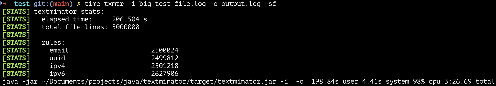

textminator (txmtr) - Manual
----------------------------

This document provides advanced usage, configuration details, performance notes, and design rationale for `textminator`.  
If you are new to the tool, start with the [README](README.md). This manual is intended for users who want deeper insight or fine-grained control.


## Input Options
### Configuration
|Option|Description|
|------|-----------|
|`-c, --config <file>`|Path to custom config file|
|`--config-example`|Print an example configuration file and exit|
|`--config-info`|Print the effective loaded configuration and exit|

### Input / Output
|Option|Description|
|------|-----------|
|`-i, --input <file>`|Input file (default: stdin)|
|`-o, --output <file>`|Output file (default: stdout)|
|`-f, --force`|Overwrite output file if already exists|

### Diagnostics & Logging
|Option|Description|
|------|-----------|
|`-s, --stats`|Print per-rule match statistics after processing|
|`--dry-run`|Same as --stats but without writing output|
|`-q, --quiet`|Suppress all diagnostic output including errors|
|`-v`|Increase verbosity; repeat up to 3 times (-vvv)|
|`--trace`|Very verbose low-level rule tracing (independent of -v)|

### Other
|Option|Description|
|------|-----------|
|`-h, --help`|Print help and exit|
|`-V, --version`|Print version and exit|


## Configuration (Full)

`textminator` uses a simple `.properties` configuration file to define regex-based sanitization rules.

Each rule describes:
- **what to match** (regular expression)
- **what to replace it with**
- **when it runs**, relative to other rules

No recompilation is required to modify or extend rules.


### Rule Definition Model

Each rule shares the same `<name>` prefix:

```properties
<name>.regex         # Required
<name>.replacement   # Optional (default: <REPLACED>)
<name>.order         # Required (lower = executed first)
<name>.enabled       # Optional (default: true)
```
Rules are applied sequentially in ascending order by `<name>.order`.  
If multiple rules share the same order:
- A warning is emitted
- Rules are applied in alphabetical order by `<name>`. This guarantees deterministic and predictable behavior.

### Example Rule

```properties
email.regex=[\w.+-]+@[\w-]+\.[\w.-]+
email.replacement=<EMAIL>
email.order=1
email.enabled=true
```

### Default Rules
The built-in configuration includes the following default rules:
- Email addresses
- UUIDs
- IPv4 addresses
- IPv6 addresses (heuristic, performance-oriented - default)

These defaults provide reasonable coverage for common log formats and can be overridden or extended as needed.  

**NOTE:** You can generate a starting configuration file using the `--config-example` option. This prints the built-in configuration to stdout, which you can then modify and reuse.
```bash
txmtr --config-example > my_config.properties
```

### IPv6 Rule Notes
The default IPv6 rule uses a heuristic approach designed for speed. It requires:
- at least two colons
- valid hexadecimal characters
This approach is significantly faster but may produce false positives in hex-heavy text (e.g. timestamps or identifiers).  
A stricter RFC-like IPv6 regex is provided in the default configuration as a commented alternative.

**Note:** Enabling the strict IPv6 regex can reduce throughput by ~40–50% based on benchmark results.

### Configuration Resolution Order
Configuration files are loaded using the following priority order (highest priority first):
1. Configuration file provided via `--config`
2. `textminator.properties` file located next to the `.jar`
3. Built-in default configuration

This allows:
- global defaults via the built-in config
- local overrides per deployment
- explicit overrides per execution

## Advanced Usage
### Stdin vs File Processing
- When reading from stdin, textminator processes input as a stream
- When reading from a file, input is buffered line-by-line

For very large files, piping via stdin may reduce I/O overhead.


### Interactive Mode & Regex Validation
When `textminator` is executed without an input file and with an interactive terminal, it enters **interactive mode**. In this mode, users can paste or type sample text directly into the terminal. Input is processed line-by-line and sanitized output is immediately returned. This is particularly useful for validating and fine-tuning regex rules before applying them to large files or production logs.

#### Typical use cases
- Testing new or modified regex rules
- Verifying replacement values
- Detecting false positives or overly broad matches
- Iteratively refining rule order and priority

#### Example workflow

1. Generate a base configuration file:
   ```bash
   txmtr --config-example > myrules.properties
   ```
2. Edit the configuration file and adjust regex rules.
3. Run textminator in interactive mode:
    ```bash
    txmtr --config myrules.properties
    ```
4. Paste sample log lines into the terminal and observe the sanitized output immediately.
5. Exit interactive mode using:
- Ctrl+D on Unix-like systems
- Ctrl+Z followed by Enter on Windows

#### Notes
- Interactive mode processes input as a stream, exactly like stdin pipelines
- Diagnostics and validation messages are written to stderr
- For deeper inspection of rule behavior, interactive mode can be combined with:
    - `--trace` (recommended only for very small samples)

Interactive mode is intended for rule development and validation, not for high-throughput processing.


### Dry-run Mode
Dry-run mode (`--dry-run`) performs all matching logic but does not modify output. Use this mode to:
- validate regex rules
- inspect replacement behavior
- debug unexpected matches


### Per-rule Statistics
The --stats option reports:
- How many times each rule matched
- Total number of replacements

This is useful for:
- validating rule effectiveness
- identifying redundant or overly broad regexes


## Tracing (Advanced Debugging)
The `--trace` option outputs detailed information for each match.

**Warning:** Tracing dramatically slows down execution and should only be used for debugging small inputs.


## Design Philosophy
`textminator` follows a few core principles:

### 1. Predictability over magical behavior
Rules apply strictly in numeric order.

### 2. Transparency
`--stats`, `--dry-run`, and `--trace` are designed to show exactly how the tool behaves.

### 3. Minimal dependencies
Only standard Java & Picocli are used.

### 4. Fail-fast
Configuration or processing errors immediately stop execution, preventing partial or misleading output.

### 5. Cross-platform consistency
Same output on macOS, Linux, and Windows.


## Performance Notes
- The tool loads all rules into memory once and applies them sequentially.
- Regex performance depends on complexity of user-defined expressions.
- `--trace` dramatically slows down processing (intended for debugging only).
- Piping through stdin avoids I/O overhead for large files.


## Benchmark
The following benchmark was executed on a MacBook Pro M1 (16GB RAM) using a synthetic log file generated specifically for performance testing using the default rules.

### Test File:
* Size: 2.1 GB
* Lines: 5,000,000
* Content: Random text containing UUIDs, IPv4, IPv6 and email patterns
* Rules: 4 regex replacement rules (from built-in config) applied to every line

### Command used:
```bash
time txmtr -i big_test_file.log -o output.log -sf
```
### Results

**Note:** Benchmark numbers may vary depending on JVM version, system load and OS-level caching.<br>
**Benchmark environment:** macOS 15, MacBook Pro M1 (16GB), OpenJDK 23. `txtminator` started with default rules (email, UUID, IPv4, IPv6).

### Interpretation
- Total (real) time: 206.7 s
- User CPU time: ~200 s → the majority of the processing time is spent inside the regex engine
- System time: ~4.4 s → very low I/O overhead
- CPU usage: 98% → fully saturates one CPU core (single-threaded stream processing)
- End-to-end throughput: ~10.4 MiB/s
- Lines processed: ~24,000 lines/s
- Total regex operations: >10 million replacements

### Summary
`textminator` is CPU-bound rather than I/O-bound. Almost all processing time is spent in the regex engine, which is expected for a single-threaded Java CLI applying multiple regex-based replacement operations per line of a multi-gigabyte file.

These results demonstrate solid real-world performance and confirm that `textminator` can efficiently process large log files without significant memory overhead.


## Third-party libraries

This project uses the following third-party libraries:

- **Picocli** – Command line parsing for Java  
Licensed under the Apache License, Version 2.0  
https://picocli.info


## Final Notes
`textminator` is designed as a practical, transparent tool for real-world log sanitization tasks. Users are encouraged to:

- review configuration carefully
- validate output using dry-run and statistics
- tailor rules to their specific data formats